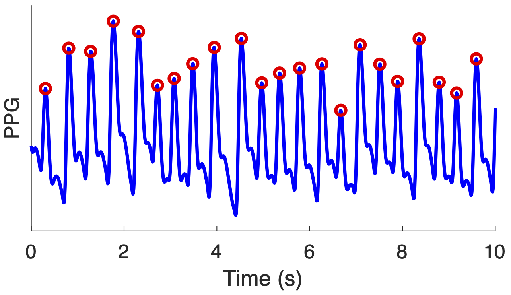

# PPG-quality

**PPG-quality** is a Matlab library of algorithms to assess the quality of photoplethysmogram (PPG) signals.

## Background

Photoplethysmography (PPG) sensors are the optical sensors which are now widely used for oxygen saturation and heart rate monitoring in clinical devices (such as pulse oximeters) and consumer devices (such as smartwatches). A wealth of information can be obtained from PPG signals, including heart rate, heart rhythm, and blood oxygen saturation. However, the PPG signal is susceptible to noise such as motion artifact. Therefore, a fundamental step when analysing the PPG signal is to assess its quality. Indeed, several approaches have been developed to assess the quality of PPG signals.

## Purpose

This software is designed to provide open-source algorithms for assessing the quality of PPG signals, and to provide a framework with which to assess their performance. The software is intended for use in research, and is therefore aimed at academic researchers.

## Features

The key features of the library are:

1. **[PPG Quality Assessment Algorithms](./toolbox/ppg_quality_algorithms)**: Algorithms for assessing the quality of PPG signals.
2. **[Tutorials](./tutorials/summary)** on how to use the algorithms.

## Getting started

Details of how to get started with the toolbox are available [here](./toolbox/getting_started/).

## Further Information

Further details of the project, including publications produced using this toolbox, are available at the [project website](https://peterhcharlton.github.io/project/ppg-quality/).

## Citation
When using this toolbox, please cite:

Charlton PH _et al._, [Detecting beats in the photoplethysmogram: benchmarking open-source algorithms](https://doi.org/10.1088/1361-6579/ac826d), Physiological Measurement, 2022.

