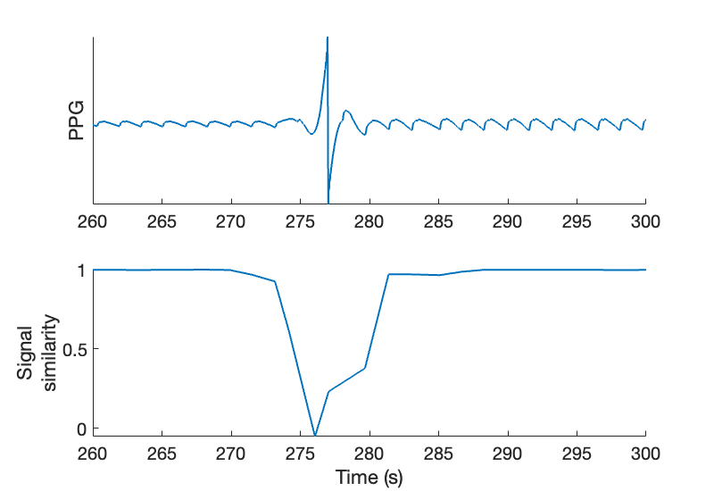

# PPG Quality Assessment

Getting started with algorithms for PPG quality assessment.

---

## Calculating quality metrics for a PPG signal

This tutorial demonstrates how to calculate quality metrics for a PPG signal using algorithms in the toolbox.

- Download an hour of [sample data](https://zenodo.org/records/5211472/files/PPGdiary1_1_hour_sample.mat?download=1) (from the PPG Diary Pilot Study dataset).
- Load this data file into Matlab. The data in this file is contained within a structure named _data_, which contains two PPG signals. In this tutorial we will use the infrared PPG signal data, which can be found at _data.ppg_ir_ (with sampling frequency of 100 Hz, as given in the field: _ppg.fs_).
- Use the following Matlab commands to detect beats in the PPG (using the 'IMS' beat detector), and then plot the PPG signal and detected beats:

```matlab
ppg = data.ppg_ir; fs = data.fs;   % extract PPG data
[qual, onsets] = assess_ppg_quality(ppg, fs);     % calculate quality metrics using default options

figure('Position', [20,20,800,550])     % Setup figure
ftsize = 20;                            % font size
lwidth = 2;                             % line width
t = [0:length(ppg)-1]/fs;             % Make time vector
ax(1) = subplot(2,1,1);
plot(t, ppg, 'LineWidth', lwidth),
ylabel('PPG', 'FontSize', ftsize),
set(gca, 'FontSize', ftsize, 'YTick', [], 'Box', 'off');
ax(2) = subplot(2,1,2);
plot(t(onsets), qual.sig_sim, 'LineWidth', lwidth),
ylabel({'Signal', 'similarity'}, 'FontSize', ftsize),
xlabel('Time (s)', 'FontSize', ftsize)
set(gca, 'FontSize', ftsize, 'Box', 'off');
linkaxes(ax, 'x')
xlim([260, 300])   % Zoom in to chosen period
```

This calculates a set of quality metrics, including the 'signal similarity' measure, as shown here for a 40-second segment of signal:


